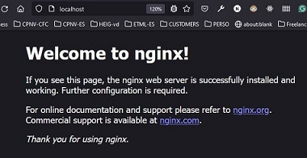

# SIG 2 - Evaluation pratique 2024 - Docker

## Travail préparatoire

### Récupérer la dernière image de nginx en exécutant les commandes suivantes

* Récupérer l'image

```
[INPUT]
docker pull nginx:latest
```

```
[OUTPUT]
Using default tag: latest
latest: Pulling from library/nginx
Digest: sha256:[...]
Status: Image is up to date for nginx:latest
docker.io/library/nginx:latest
```

* Valider le résultat

```
[INPUT]
docker images
```

```
[OUTPUT]
nginx         latest    e4720093a3c1   13 days ago         187MB
```

<div style="page-break-after: always;"></div>

### Instancier le conteneur

Information technique : l'[image officielle](https://hub.docker.com/_/nginx) de Nginx écoute par défaut le port 80.

* Lancer le conteneur en mappant le port local 80 avec le port 80 du conteneur

```
[INPUT]
docker run -p 80:80 nginx
```

```
[OUTPUT]
[...]
2024/02/28 12:11:40 [notice] 1#1: start worker process 40
```

* Valider la redirection de port et l'état du conteneur

```
[INPUT]
docker ps -a
```

```
[OUTPUT]
CONTAINER ID   IMAGE     COMMAND                  CREATED          STATUS          PORTS                NAMES
61aed0b54f34   nginx     "/docker-entrypoint.…"   55 seconds ago   Up 54 seconds   0.0.0.0:80->80/tcp   <names>
```

<div style="page-break-after: always;"></div>

### Afficher la page d'accueil de Nginx

* Variante en ligne de commande

```
[INPUT]
curl localhost
```

```
[OUTPUT]
<!DOCTYPE html>
<html>
<head>
<title>Welcome to nginx!</title>
<style>
html { color-scheme: light dark; }
body { width: 35em; margin: 0 auto;
font-family: Tahoma, Verdana, Arial, sans-serif; }
</style>
</head>
<body>
<h1>Welcome to nginx!</h1>
<p>If you see this page, the nginx web server is successfully installed and
working. Further configuration is required.</p>

<p>For online documentation and support please refer to
<a href="http://nginx.org/">nginx.org</a>.<br/>
Commercial support is available at
<a href="http://nginx.com/">nginx.com</a>.</p>

<p><em>Thank you for using nginx.</em></p>
</body>
</html>
```

* variante via votre navigateur




*** fin du document ***